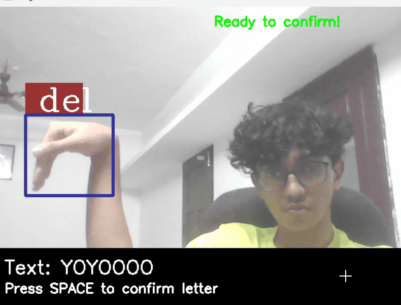

# ASL Detection and Text Input System


#### Special Signs (Space and Delete)



## 📝 Description

A real-time American Sign Language (ASL) detection system that allows users to input text using hand gestures. This project uses computer vision and machine learning to recognize ASL signs and convert them into text.

## ✨ Features

- Real-time ASL sign detection using webcam
- Support for all 26 letters of the alphabet (A-Z)
- Special signs for space and delete operations
- User-friendly text input system with confirmation
- Visual feedback for detected signs
- Error handling for improper hand positioning
- Simple and intuitive interface

## 🛠️ Requirements

- Python 3.11.7
- OpenCV (cv2) 4.10.0.84
- cvzone 1.5.6
- NumPy
- TensorFlow 2.12.1
- mediapipe 0.10.18

## 📦 Installation

1. Clone this repository:
```bash
git clone https://github.com/adn26/asl_detection.git
cd asl_detection
```

2. Install the required packages:
```bash
pip install opencv-python==4.10.0.84
pip install cvzone==1.5.6
pip install numpy
pip install tensorflow==2.12.1
pip install mediapipe==0.10.18
```

3. Make sure you have the model files in the correct location:
   - `model/keras_model.h5`
   - `model/labels.txt`

## 🚀 Usage

1. Run the program:
```bash
python test.py
```

2. Position your hand in front of the camera:
   - Keep your hand within the camera frame
   - Maintain a reasonable distance from the camera
   - Ensure good lighting conditions

3. Show ASL signs:
   - Display the sign for the letter you want to input
   - Wait for the "Ready to confirm!" message
   - Press the spacebar to confirm the letter
   - The letter will be added to the text area

4. Special Controls:
   - Press 'c' to clear the text
   - Press 'q' to quit the program

## ⌨️ Controls

- **Spacebar**: Confirm and add the detected letter
- **'c' key**: Clear all text
- **'q' key**: Quit the program

## 💡 Tips for Best Results

1. Hand Positioning:
   - Keep your hand at a moderate distance from the camera
   - Ensure your hand is fully visible in the frame
   - Maintain a steady hand position while showing signs

2. Lighting:
   - Use good lighting conditions
   - Avoid backlighting
   - Ensure your hand is well-lit

3. Sign Recognition:
   - Hold signs clearly and distinctly
   - Wait for the confirmation message before pressing spacebar
   - If a sign isn't recognized, try adjusting your hand position

## ⚠️ Error Handling

The system includes error handling for common issues:
- Invalid hand positions
- Out-of-frame hands
- Too close to camera
- Poor lighting conditions

When these issues occur, a helpful message will guide you to correct your hand position.

## 🔮 Future Improvements

Potential enhancements for future versions:
- Support for numbers and special characters
- Word prediction and auto-completion
- Multiple hand tracking
- Custom sign training
- Improved accuracy and recognition speed

## 🤝 Contributing

Feel free to contribute to this project by:
1. Forking the repository
2. Creating a feature branch
3. Making your improvements
4. Submitting a pull request

## 📄 License

This project is licensed under the MIT License - see the LICENSE file for details.

## 🙏 Acknowledgments

- Thanks to the cvzone library for hand tracking functionality
- The ASL recognition model used in this project
- Contributors and testers who helped improve the system

## 📧 Contact

For questions, suggestions, or issues, please open an issue in the repository. 